# Koi - 多功能信息收集与处理工具
# 2026-6-6 更新
新增测试agent
# 闲来无事
老是碰到大量重复性的工作，想着让ai写个工具能够简化一下我的操作，并且也结合了以前写的一些工具，集成了一下

## 项目简介

Koi 是一个集成了多种功能的桌面应用程序，主要用于信息收集、威胁情报分析、文档处理等安全相关工作。

## 主要功能

### 🔍 信息收集
- **威胁情报查询**：支持 IP、域名、文件哈希等威胁情报查询
- **企业信息查询**：集成多个企业信息查询平台
- **资产映射**：网络资产发现和映射功能

### 📄 文档处理
- **文档转换**：Word 转 PDF、PDF 提取等
- **报告重写**：通报内容重写功能

### 🛠️ 数据处理
- **Excel 处理**：数据填充、字段提取等
- **模板管理**：支持自定义数据处理模板

### 🚨 应急响应
- **周报生成**：自动化周报生成工具

## 安装和使用

### 环境要求
- Python 3.8+
- Node.js 20+
- Rust stable
- 其他依赖见 `requirements.txt`

### 安装步骤

1. 克隆项目
```bash
git clone https://github.com/lan1oc/koi.git
cd koi
```

2. 安装依赖
```bash
pip install -r requirements.txt
```

3. 配置设置
自动生成config.json

4. 运行程序
```bash
cd tauri-ui
npm install
npm run tauri dev
```

或者直接通过编译吧
```bash
./build_release.ps1
```
or
```bash
./build_release.cmd
```

## 配置说明

程序需要配置各种 API 密钥才能正常工作：

- **Hunter API**：用于网络资产查询
- **Quake API**：用于网络空间测绘
- **FOFA API**：用于网络资产搜索
- **微步 API**：用于威胁情报查询
- **企业查询 Cookie**：用于企业信息查询（天眼查、爱企查）


# 信息收集
## 企业查询
### 天眼查
抓个cookie，记得得网页先查一下，身份验证通过以后就行了
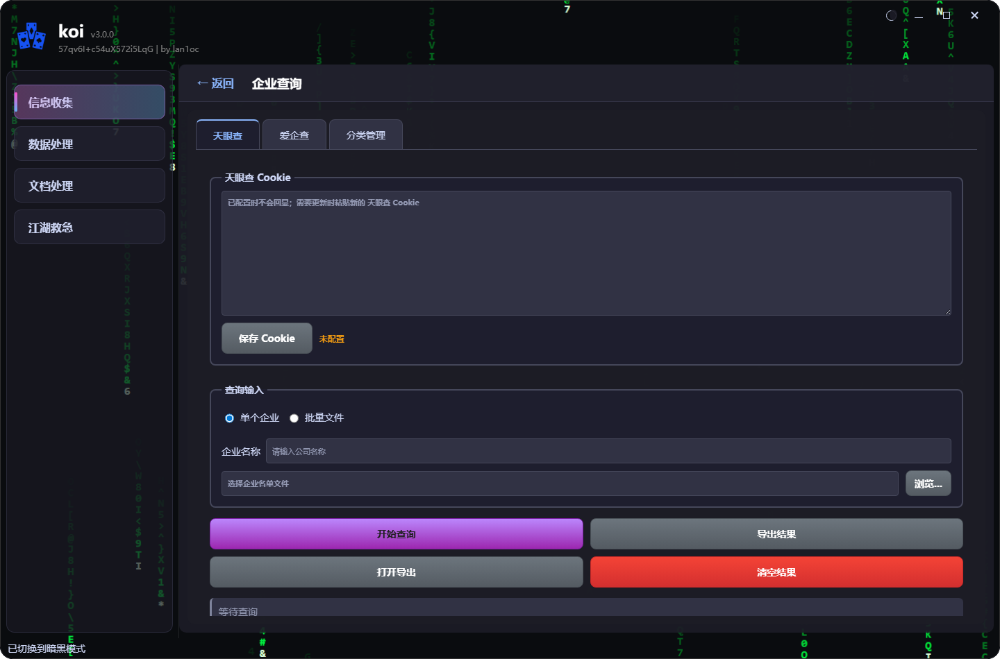
批量最多能查多少还不知道，最多的的是，一次性查了77家，然后没被ban

### 爱企查
抓个cookie直接查，而且cookie可用时间很久啊，半个多月了，具体忘了，反正挺久
能查地址、注册号、备案号、资产主域名、员工联系方式（不保真，就是爱企查那边更多手机号的信息）
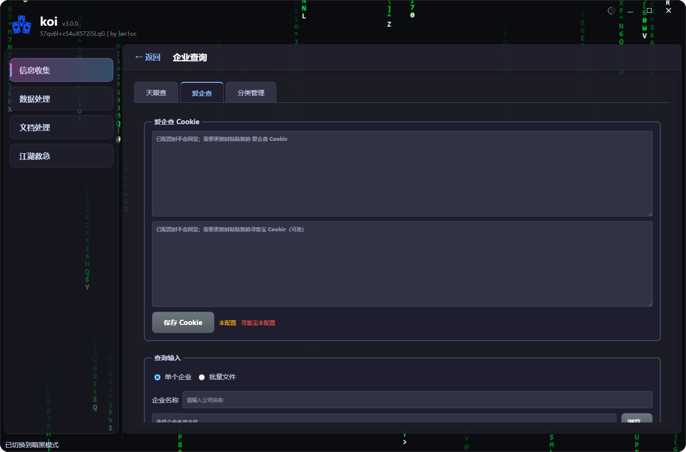

## 资产测绘
如下
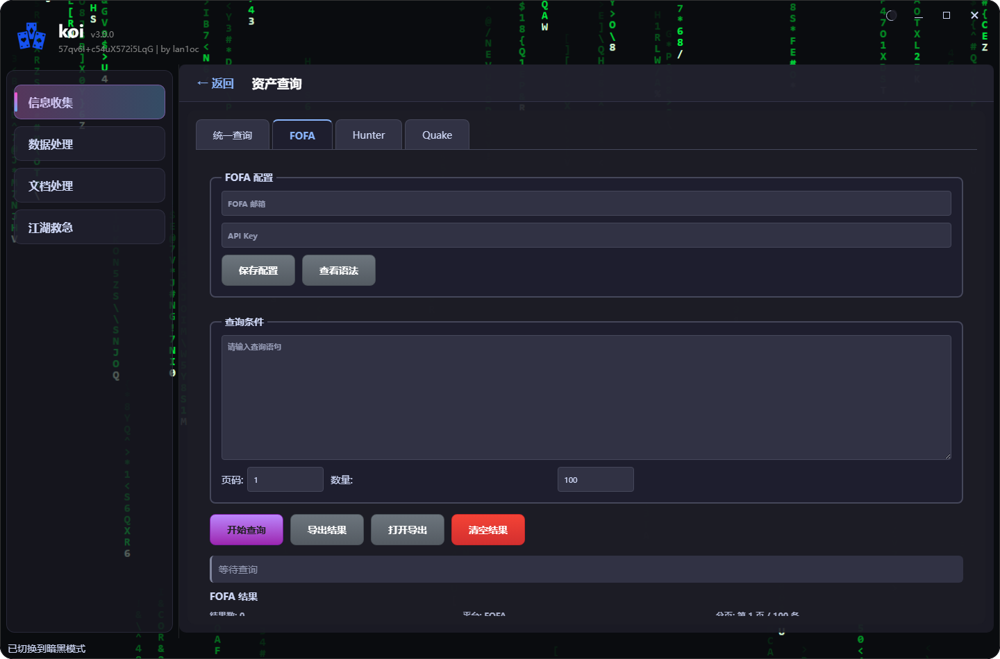

## 威胁情报
根据微步的api写的，但是比较鸡肋，md基本有用的功能都不让你免费用
### ip信誉
界面如下
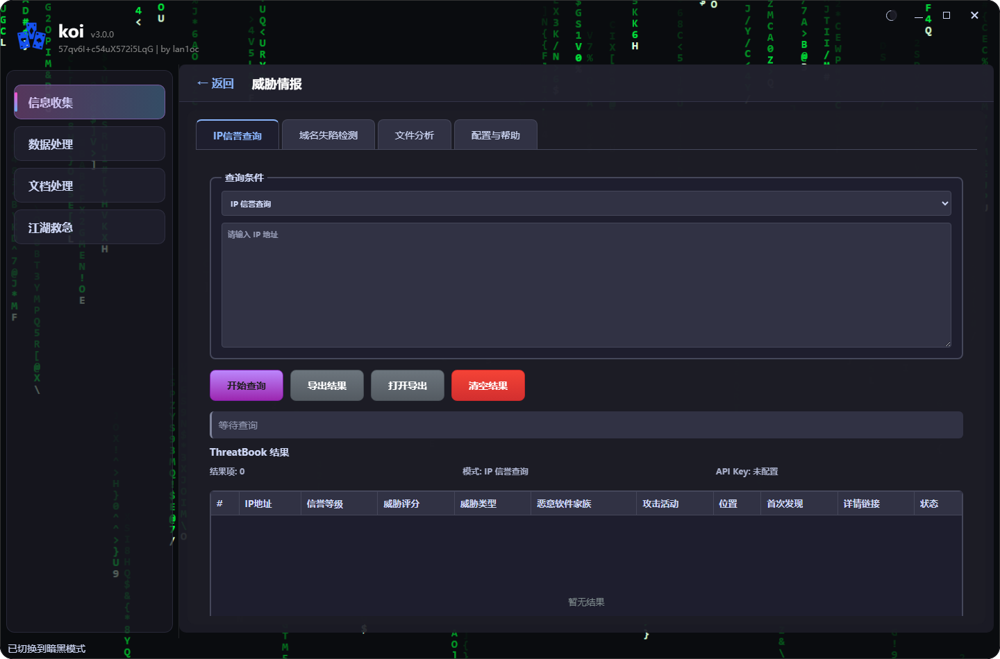

### 域名失陷检测

如下

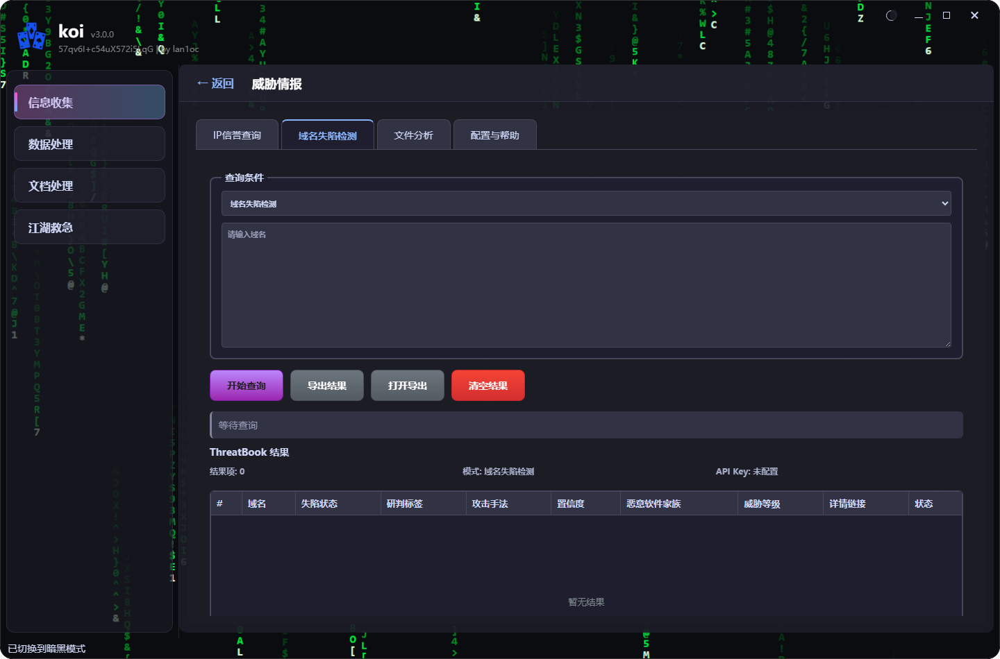

### 文件分析

#### 哈希查询

界面如下

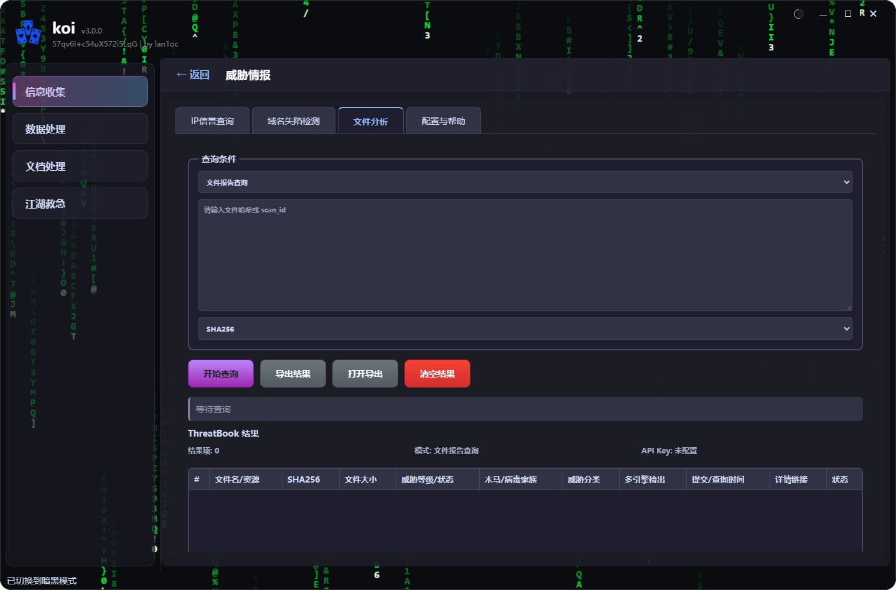


#### 文件上传

界面如下


查询结果


打开报告


详情


# 数据处理
## 字段提取
测试文件如下

选择文件后，会识别分隔符，如果识别不到可以手动设置，然后自动读取表头信息

比如提取url和公司

文件如下

## 数据填充
这个功能就是服务于前面的，提取后的数据填充到对应的模板上面
源文件就是提取后的数据文件，然后再选个模板文件
比如模板文件是这样

选好文件后，然后要选择映射

然后点启用映射就行，映射情况如下

开始填充

填充好之后


## 模板管理
这个就是之前数据填充那边，将映射关系保存为模板之后查看的地方
界面如下

模板信息

# 江湖救急
## 周报生成
界面长这样
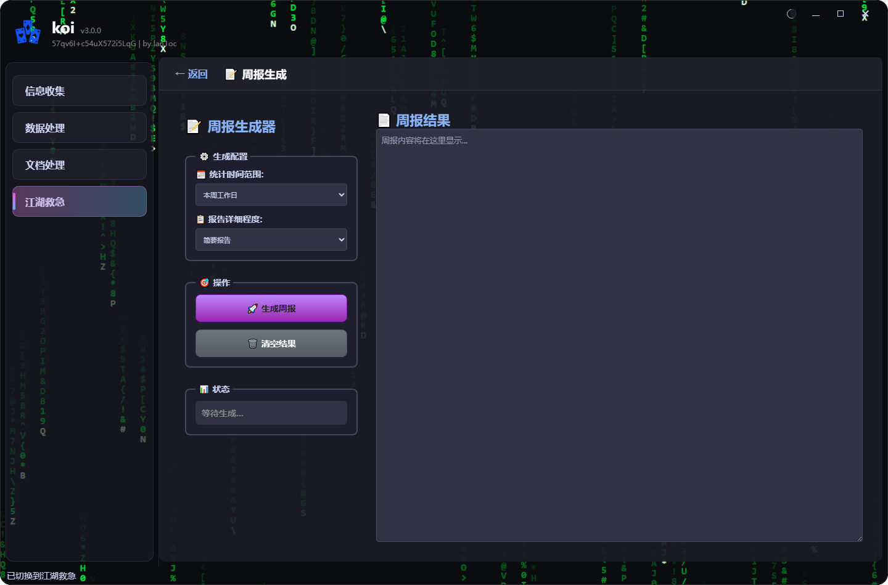
运行结果


# 文档处理
## 通报改写（自用）
按照流程然后写成工具自动化改写了
有时候会遇到一些bug，成因是com接口调用繁忙，上一次调用的句柄还未释放，然后就已经到下个通报改写的调用了，就会造成图片插入失败
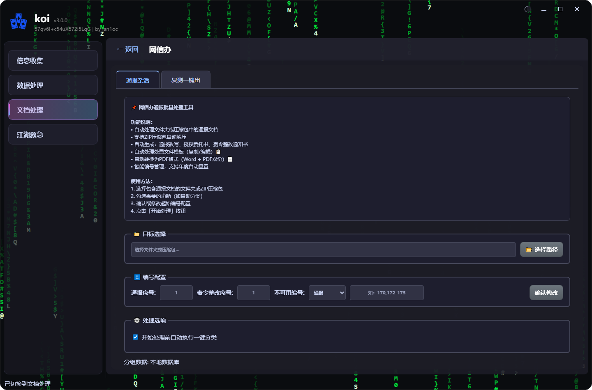
但其实影响不是不大，毕竟本身这个操作就是需要我手动微调的，不过也分两种情况
1. 文档里没有插入设置为`浮于文字上方`的盖章样式图片
2. 插入了但没保存，打开后要另存为才行，如下图所示

然后就是微调完，点击转换pdf的按钮，那个就是专门转换通报的
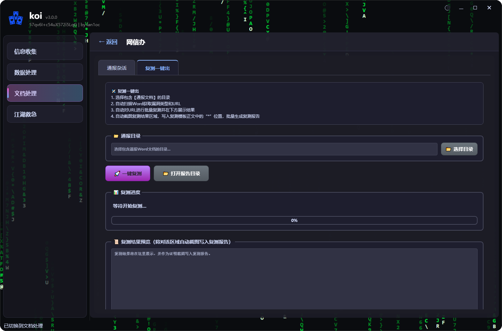
## word转pdf
界面如下
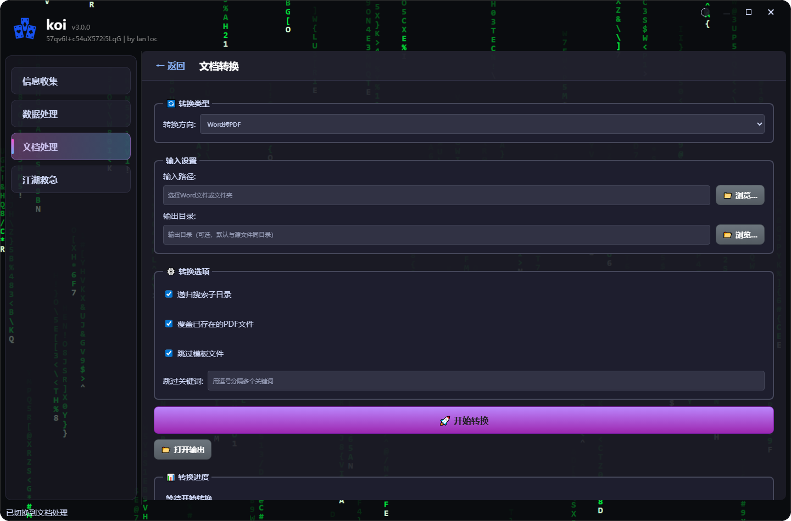
## pdf提取
提取pdf用的，界面如下
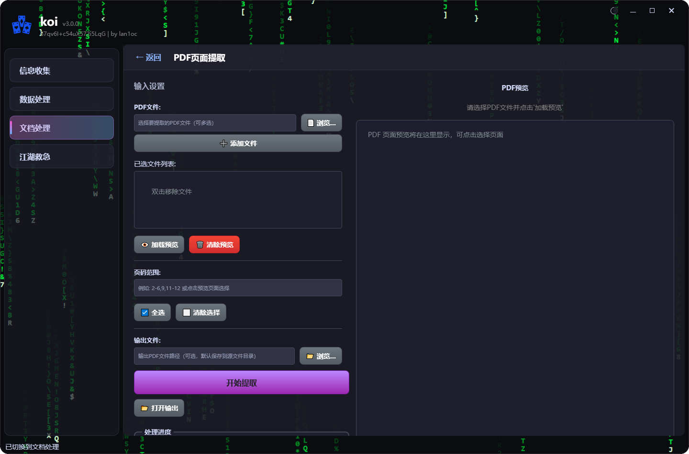
预览


# 2026-6-6 更新
新增测试agent
# 2026-5-21 更新
前端用tauri重构，非常丝滑，然后布局细微优化重构
# 2026-1-22 功能更新
爱企查模块新增cookie获取机制，直接查询，会检测是否有cookie，或者cookie是否可用，然后启动浏览器扫码登录获取cookie
# 2025-12-29 功能更新
分组功能优化，添加标签页可视化更改
# 2025-12-17 功能更新
pdf转换bug修复、pdf提取功能优化，启动动画优化逻辑
# 2025-11-23 功能更新
加了启动动画，ui也更新了下，gemini3pro太通人性了，太会设计了😋
# 2025-11-3 功能更新
天眼查模块新增cookie获取机制，直接查询，会检测是否有cookie，或者cookie是否可用，然后启动浏览器扫码登录获取cookie
